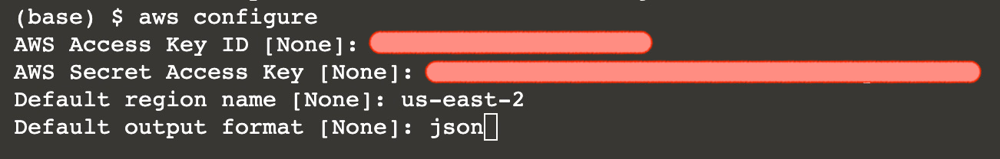

## Prerequisites

Install AWS CLI

`sudo apt-get update && sudo apt-get -y install awscli`{{execute}}

Login to AWS Account Using AWS CLI

`aws configure`{{execute}}

- To login, we will use AWS Secret Key ID and AWS Secret Access Key. They can be created from the AWS Management Console.
- Type in your default region name, ex. `us-east-2`. List of regions can be found [HERE](https://docs.aws.amazon.com/AmazonRDS/latest/UserGuide/Concepts.RegionsAndAvailabilityZones.html#Concepts.RegionsAndAvailabilityZones.Regions)
- Default output format: `json`

 

## Create the execution role

`aws iam create-role --role-name lambda-ex --assume-role-policy-document '{"Version": "2012-10-17","Statement": [{ "Effect": "Allow", "Principal": {"Service": "lambda.amazonaws.com"}, "Action": "sts:AssumeRole"}]}'`{{execute}}

Add permissions to the role

`aws iam attach-role-policy --role-name lambda-ex --policy-arn arn:aws:iam::aws:policy/service-role/AWSLambdaBasicExecutionRole`{{execute}}

