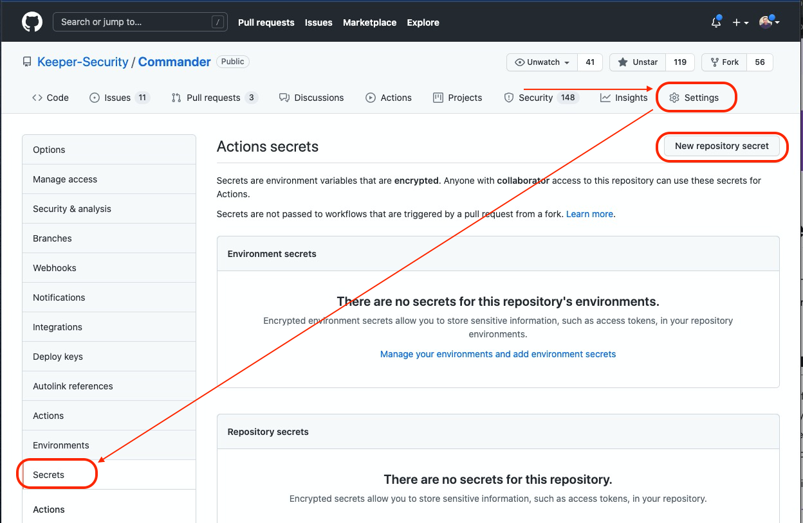
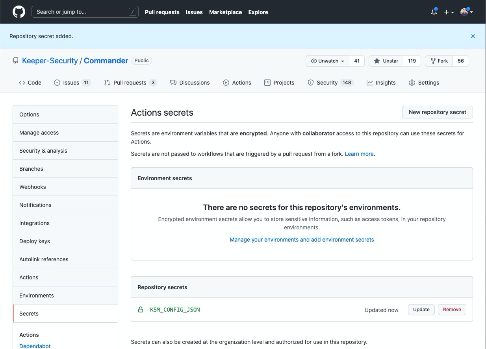

Generate Config JSON or Base64 String:

### Login to commander

`keeper shell`{{execute}}

### Generate new client for your application

**Wait for Commander to finish installation**

`sm client add --app [APP NAME] --unlock-ip --config-init json`{{copy}}

You should get following output:

```json
Successfully generated Client Device
====================================
Initialized Config: {"hostname": "keepersecurity.com","clien[...]ZcUefxPWewf03LLGeoei0="}
IP Lock: Disabled
Token Expires On: 2021-10-20 15:07:02
App Access Expires on: Never
```

Navigate to GitHub Actions and add a new secret (Settings -> Secrets -> New repository secret)
that will contain config json that was generated above. 
You can use regular Repository Secrets store, or Environment secrets (recommended).



Create new Secret


Below is the screenshot of the final screen after secret was added



In the next step we will use this secret in Keeper Secrets Manager GitHub Action
