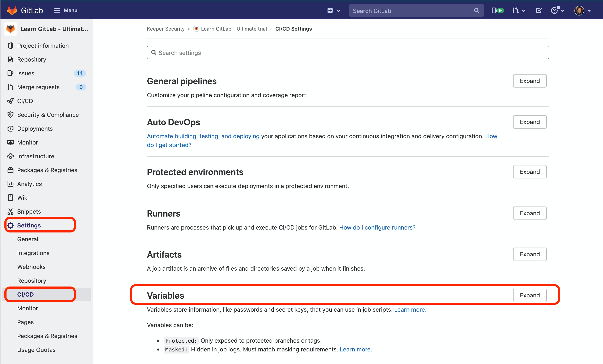
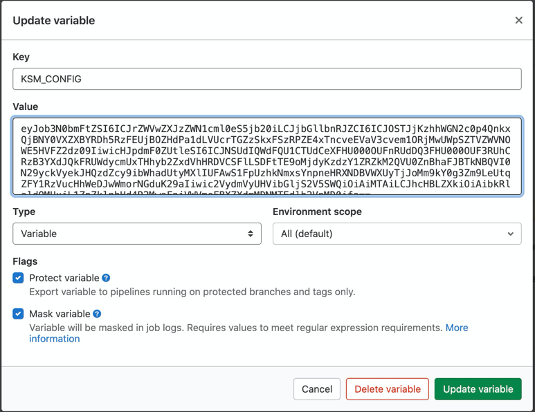
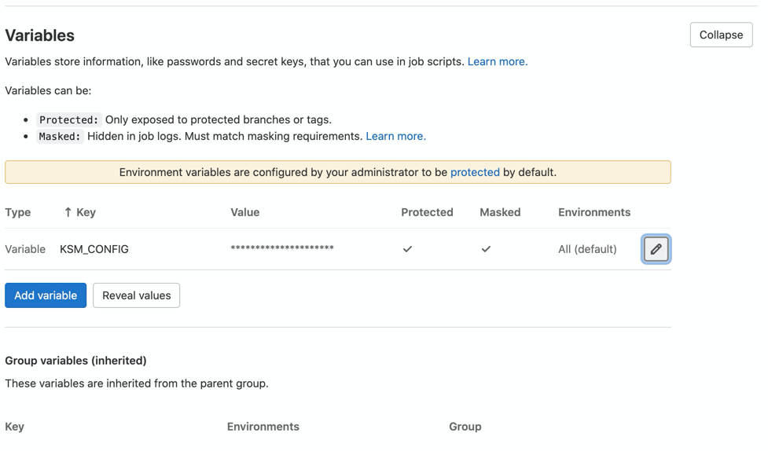

# GitLab Pipelines

Setting up Secret Environment variable that will contain KSM Configuration:

Navigate to GitLab Settings -> CI/CD -> Variables

Create a new variable by setting Key as any name for the variable and Value should be JSON or Base64 Configuration string

> Note: Make sure to set this variable to be "Protected" and "Masked" 



Final view of the screen that shows secret variable being set:



In order to use Keeper Secrets Manager CLI tool, first we need to install it from PyPi registry.
This can be achieved by adding following line to the `before_script:` area:

```yaml
before_script:
- python3 -V  # Python3 and pip module are required in the image
- python3 -m pip install keeper-secrets-manager-cli
- export KSM_CONFIG=$KSM_APP1_CONFIG # This line will inject secret as
```


Inject Field Secret value into environment variable using Keeper Notation:

```yaml
- export MY_PWD=$(ksm secret notation keeper://6ya_fdc6XTsZ7i7x9Jcodg/field/password)
```

Inject Custom Field value:

```yaml
- export MY_ISBNCODE=$(ksm secret notation keeper://6ya_fdc6XTsZ7i7x9Jcodg/custom_field/isbncode)
```


Download file:

```
- ksm secret download -u 6ya_fdc6XTsZ7i7x9Jcodg --name "mykey.pub" --file-output "/tmp/mykey.pub"
```

In the case above, file will be downloaded to `/tmp/mykey.pub` 

Complete example of the pipeline:

```
image: python:latest

before_script:
  - python3 -V  # Print out python version for debugging
  - python3 -m pip install keeper-secrets-manager-cli

job1:
  stage: build
  script:
    - export MY_PWD=$(ksm secret notation keeper://6ya_fdc6XTsZ7i7x9Jcodg/field/password)
    - export MY_ISBNCODE=$(ksm secret notation keeper://6ya_fdc6XTsZ7i7x9Jcodg/custom_field/isbncode)
    - ksm secret download -u 6ya_fdc6XTsZ7i7x9Jcodg --name "mykey.pub" --file-output "/tmp/mykey.pub"
    - file /tmp/mykey.pub
```

To learn more about Variables in GitLab you can read [HERE](https://docs.gitlab.com/ee/ci/variables/)